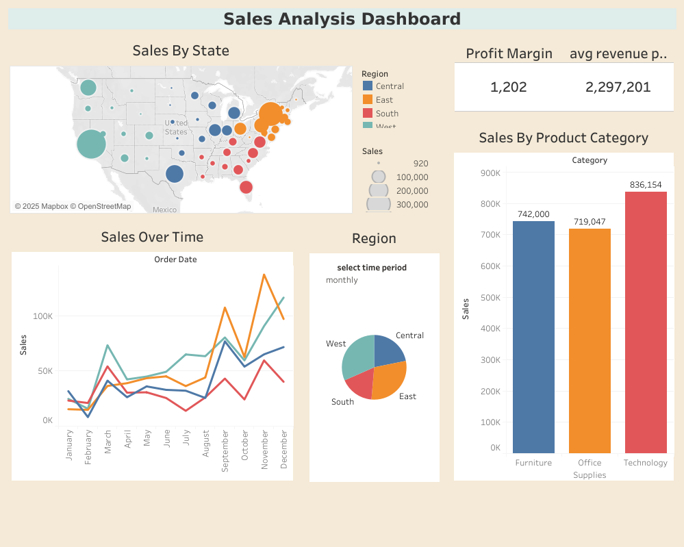

# 📊 Sales Analysis Dashboard

## 1️⃣ Project Overview
The **Sales Analysis Dashboard** is an interactive business intelligence solution developed in **Tableau**, designed to evaluate sales performance across multiple dimensions.  
This project demonstrates the practical application of **data analysis, visualization, and storytelling** to drive business decision-making.

The solution comprises:  
- **4 interactive dashboards**  
- **22 captions** (insight annotations) for data storytelling  

---

## 2️⃣ Project Objectives
- Perform **comprehensive data exploration** to uncover trends, patterns, and anomalies in sales data.
- Create dynamic and interactive dashboards for intuitive data consumption.
- Apply visual analytics to support strategic and operational decision-making.
- Showcase professional expertise in data visualization, business analytics, and Tableau.

---

## 3️⃣ 🚀 Live Dashboard Access
👉 **Click the image above or the link below to view the interactive dashboard:**  
🔗 [**View Sales Analysis Dashboard on Tableau Public**](https://public.tableau.com/views/TableauAssignmentDONE/Salesanalysisdashboard?:language=en-US)  

---

## 4️⃣ Key Dashboard Components

### **Dashboard 1 – Sales Performance Overview**
- High-level KPIs (Revenue, Profit, Sales Volume)
- Monthly & yearly sales trends
- Category-wise and subcategory performance

### **Dashboard 2 – Regional & Category Analysis**
- Sales breakdown by **state, region, and category**
- Heatmaps for quick performance identification
- Regional contribution to total revenue

### **Dashboard 3 – Customer Insights**
- Top-performing customers by revenue & order size
- Segmentation of customers based on spending patterns
- Retention & loyalty indicators

### **Dashboard 4 – Profitability & Trends**
- Comparative analysis of profitable vs. low-performing products
- Seasonal sales trends
- Forecasts & performance tracking over time

---

## 5️⃣ Tools & Technologies
- **Tableau Public** – Data visualization & dashboard creation
- **Data Preparation** – Data cleaning, aggregation, and transformation
- **Visualization Techniques** – Bar charts, line charts, heat maps, KPIs, filters, parameters

---

## 6️⃣ Key Insights Delivered
- Identified **high-revenue regions** and their contribution to overall performance.
- Detected **seasonality and peak sales periods** assisting in inventory planning.
- Highlighted **low-margin products** for pricing strategy review.
- Segmented **customers for targeted promotions** to improve retention.

---

## 7️⃣ Skills & Competencies Demonstrated
- Data Cleaning & Transformation
- Visual Analytics & Storytelling
- Dashboard Design & User Experience
- Business KPI Analysis
- Performance Monitoring & Reporting

---

## 8️⃣ Contact & Portfolio
📧 **Email:** [morwalhemanshu@gmail.com](mailto:morwalhemanshu@gmail.com)  
💼 **LinkedIn:** [linkedin.com/in/hemanshumorwal](https://linkedin.com/in/hemanshumorwal)  
🐙 **GitHub:** [github.com/hemanshumorwal](https://github.com/hemanshumorwal)

---

**📌 Note:** This project was developed to demonstrate competence in **business intelligence, data visualization, and Tableau dashboard design**.
